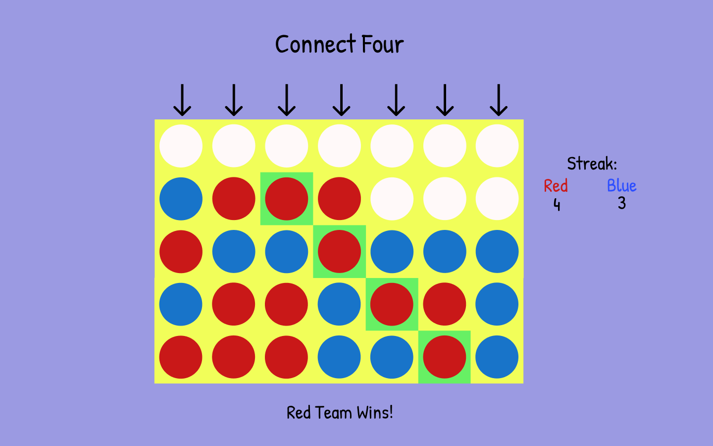

# connect-four
Welcome to connect four! This is a virtual connect four game. This is the unit 1 project for General Assembly

## Wireframe 


## User Stories
As A player I want to 

* Only place one color chip the entire time
* Be able to select a column to place my chip in 
* Have my chip fall to the correct location 
* Alternate turns with my opponent who is a different color than I am 
* Win the game if I get four chips in a row (horizontally, vertically, or diagonally)
* Be told when someone wins 
* Tie when there are no moves left to make (and be told of the tie)
* Be able to reset the game
* Measure my score against my opponent.

--STRETCH GOALS--
* Have my chip fall to the correct location 
* Choose between multiple board sizes (level up) 
* Players can pick their teams
* Play against a (not completely random)computer when I am alone 

## Technologies 
```
Javascript
HTML
CSS
Jquery
```

## Hosted Game URL 
https://ejgolden94.github.io/connect-four/

## Unsolved problems and Fourthcoming Features
### Known Issues
- There is a known issue in this game where if you click really quickly (before the last piece falls) you will experience some weirdness 

### Future Features
- I am currently working on a single player mode where you would be playing a non random computer 
- Considering working on adding a highlighting to the winning chips in a row